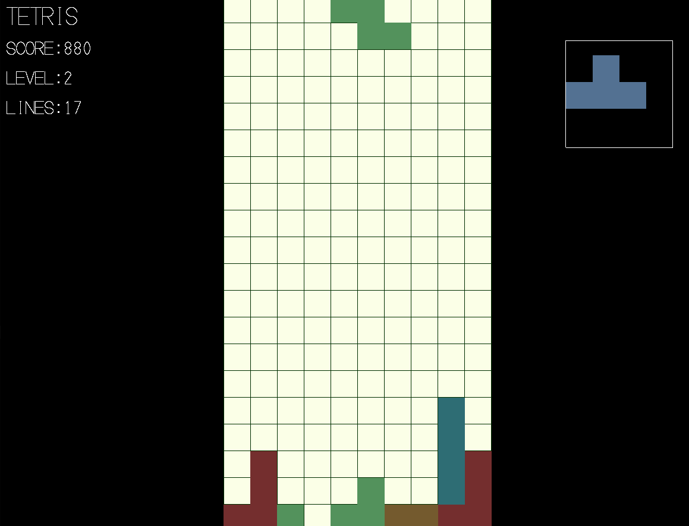

# Tetris By Reid

This is a recreation of one of my favorite games in c++. It requires the library from here to run: https://github.com/gravesreid/great_YS_libraries.git

This is only configured to compile on Linux

## Steps to Build
```
git clone https://github.com/gravesreid/TetrisByReid.git
```
```
 git clone https://github.com/gravesreid/great_YS_libraries.git
```
```
cd TetrisByReid
```
```
mkdir build
```
```
cd build
```
```
cmake ..
```
```
cmake --build .
```

## Start the game
```
cd build
```
```
./tetris
```

## Controls
- Up arrow: change shape orientation
- Down arrow: accelerate shape
- Left and right arrows: move shape left and right

